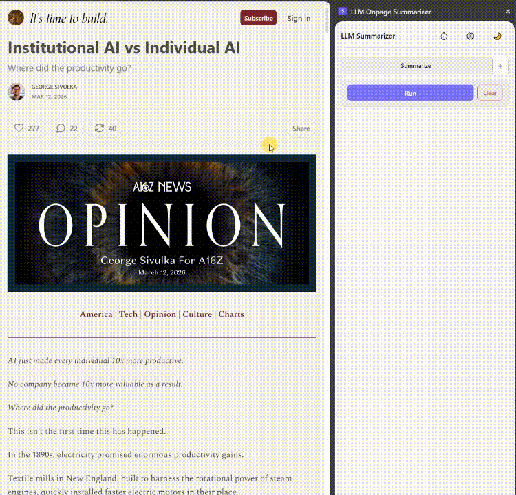

# llm-onpage-summarizer

A Chrome extension that summarizes the current web page using an **LLM via [Ollama](https://ollama.com)**. No API keys required — Ollama supports both local and cloud-backed models, and you decide where your data goes.

## Why bother?

You shouldn't read everything that lands in your browser. Most content isn't worth your time.

- **Cut the Noise** — get the gist of articles, logs, or tickets instantly.
- **Zero Friction** — no tab switching, no copy-pasting.
- **Decide Faster** — see the core idea first, then decide if it's worth the deep dive.
- **Your Data, Your Call** — Ollama supports both local and cloud-backed models. With local models, your content never leaves your machine.

Stop wasting minutes on fluff. Start with the summary.



## How it works

**Full page:**
1. Click the extension icon — a side panel opens
2. Select a mode: **Summarize** or any custom tab
3. Click **Run**
4. The extension extracts the page text and sends it to your local Ollama instance
5. The result streams back token by token into the panel

**Selected text:**
1. Select any text on the page with your mouse
2. Right-click → **Analyze with LLM Summarizer**
3. The side panel opens and runs automatically with just that fragment

## Requirements

- Chrome 114+ (side panel API)
- [Ollama](https://ollama.com) running locally on `http://localhost:11434`
- At least one model pulled, e.g.: `ollama pull <model-name>`

## Installation

1. Clone or download this repo
2. Open Chrome → `chrome://extensions`
3. Enable **Developer mode** (top right)
4. Click **Load unpacked** → select the `llm-onpage-summarizer` folder
5. Click the extension icon in the toolbar to open the side panel

## Usage

| Control | Description |
|---|---|
| Tabs | Switch between prompt tabs (Summarize + any custom tabs you add) |
| **Run** | Extract full page text and send to Ollama |
| Right-click → **Analyze with LLM Summarizer** | Select any text on the page, right-click, and send just that fragment — useful when you want to analyze a specific section rather than the whole page |
| **Stop** | Cancel an in-progress generation |
| **Clear** | Remove the current result |
| **Copy** | Copy result to clipboard (bottom of result area) |
| **⧉** | Open result in a full-view reader — located in the top-right corner of the result area |
| **⋯** | Choose how the viewer opens: **Open in popup window** or **Open in new tab**. Toggle **Auto-open when done** to have the viewer open automatically after every generation — no click needed |
| ⚙ Settings | Configure model, max text length, Ollama URL, prompt template, Markdown toggle |
| ⏱ History | Browse last 8 results |

## Configuration

| Setting | Default | Description |
|---|---|---|
| Model | fetched from Ollama | Dropdown of all locally available models |
| Ollama URL | `http://localhost:11434` | Change if Ollama runs on a different port |
| Prompt template | built-in per mode | Fully editable — see section below |
| Render Markdown | off | Toggle rich formatting in the result |
| Max text length | 12 000 chars | Hard cap to prevent context overflow |

## Prompt and model — both matter

> **Result quality depends on two things: the model you choose and the prompt you write. Neither alone is enough.**

The extension ships with one default tab — **Summarize**. Add more tabs via the **+** button, name them however you like, write a completely custom prompt for each.

Open ⚙ Settings → **Prompt template** to edit. Use `{{text}}` as the placeholder for page content.

### Why the prompt matters

More explicit instructions tend to produce more focused results. A prompt that specifies format, language, and scope gives the model clearer direction than a vague one.

If results aren't what you expected, adjusting the prompt is often a good first step — though switching models may help just as much.

### A prompt structure to start with

One pattern that tends to work well: give context first, then content, then the output instruction last.

```
Read the following text — it may be in any language.

{{text}}

Now write a summary in [your language] in 4–6 bullet points.
Always respond in [your language], regardless of the language of the text above.
```

Replace `[your language]` with whatever you need. You can adapt this structure for other tasks — key points, action items, translation, etc.

### Tips

- Be explicit about format: "Use bullet points", "Keep it under 5 sentences", "Start each point with a verb"
- Try putting the output instruction **after** `{{text}}` — some models respond better to instructions placed last
- If a model ignores your language instruction, try a different one — multilingual behavior varies across models
- Create separate tabs for different tasks: one for quick summaries, one for deep analysis, one for extracting action items

## Model choice matters

Different models can produce quite different results for the same prompt. Results vary by hardware, model version, and prompt. Experimenting with different combinations is the most reliable way to find what works for your use case.

### Managing your model list

When you have many models installed, the dropdown gets noisy fast. **Manage models** lets you build a personal layer on top of what Ollama provides — rate what works, hide what doesn't — without touching Ollama itself.

Open ⚙ Settings → **Manage models**:

- **★★★★★ — Rate models** by clicking the stars next to each name. Highly rated models float to the top of the dropdown so your best options are always first.
- **Hide** — removes a model from the dropdown without touching Ollama. Useful for models you've tested and ruled out. Hidden models appear in a separate "Hidden" section and can be restored at any time.

Ratings and hidden state are saved locally in the extension and survive restarts. They are independent of prompt tabs — one rating applies across all tabs.

## Privacy

The extension sends page content only to the Ollama endpoint configured in settings (`localhost` by default). Where that content goes from there depends on the model you choose — local models keep everything on your machine, while cloud-backed models route it to the respective provider. You are in control of that choice.

## License

MIT
